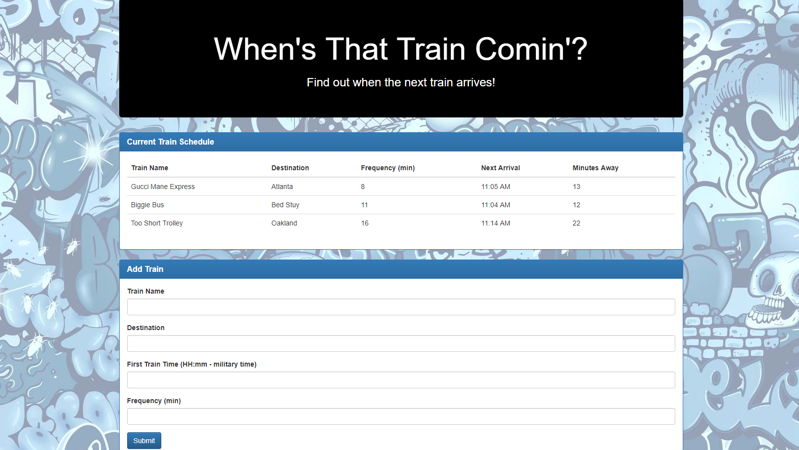

# Firebase Train Schedule Application

 [View Live!](https://bereznd1.github.io/TrainScheduler/) 

## Brief Description

The **Firebase Train Schedule Application** allows users to enter a *Train Name*, *Destination*, *First Train Time*, & *Frequency*, and then their input gets stored in a **Firebase** database. When a new item is added to the database, the table at the top of the page with all the train information gets updated & it displays the next arrival time of the train, as well as how many minutes away it is. These last two pieces of information are calculated on the front end by using a JavaScript library called **MomentJS**, which is used to simplify working with dates & times in JavaScript.

## How This Was Achieved

First, I used the code that Firebase provided me in order to initialize Firebase on my page. Next, I created a function that gets called when the submit button is clicked in the "Add Train" section. This function grabs the information that the user typed into the fields & creates an object to store the train data. It then pushes this object to the root directory of the Firebase database. The reason that *push* is used and not *set* is because we want new objects to be added into the database every time the user hits "submit", and not for each new object to to replace the existing one.

Next, I created a Firebase event that watches for when a new child is added to the database, and every time that happens, as well as when the page first loads, it gets the various values from each child in the database and stores them in local variables. 

The JavaScript library **MomentJS** is then used to calculate 2 values that aren't explicitly entered by the user. These are the "Next Arrival" and "Minutes Away" values. In order to do this, Moment converts the First Train Time from Unix time to military time, and then subtracts one day from that time value in order to make sure that the train arrives initially before the current time. Moment then finds the time difference between the current time and the First Train Time and uses the modulo operator in order to calculate the number of minutes since the last train came (the "remainder"). Next, to determine the number of minutes until the next arrival ("Minutes Away"), the remainder value is subtracted from the "frequency" of the train's arrivals.

Finally, to find the "Next Arrival" time, Moment adds the "Minutes Away" value to the current time & then converts this value from Unix time to Local Time. Next, **jQuery** is used to append a new row to the table at the top of the page. This row displays the "Train Name", "Destination", "Frequency", "Next Arrival", & "Minutes Away" values for each train.